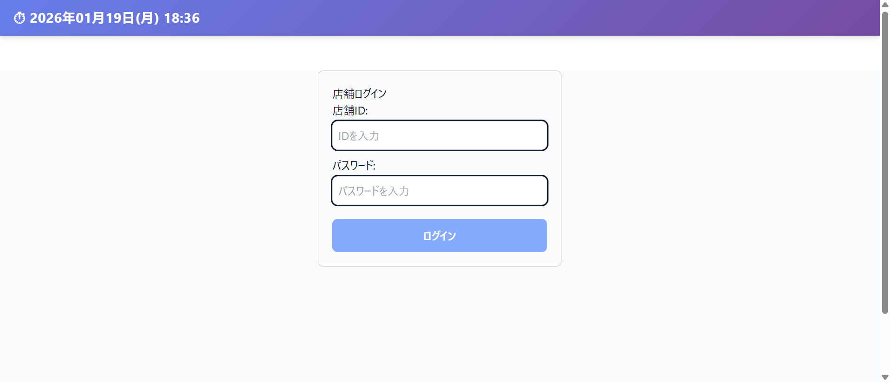
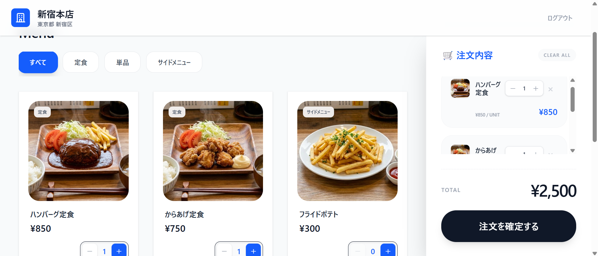
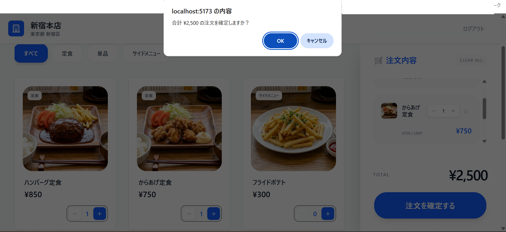

# Food Ticket System (食券機システム)

飲食店向けのデジタル食券機シミュレーター。顧客向けの注文画面と、管理者向けの商品・在庫管理機能を備えたWebアプリケーションです。

## 📋 目次

- [機能概要](#機能概要)
- [技術スタック](#技術スタック)
- [セットアップ](#セットアップ)
- [使い方](#使い方)
- [プロジェクト構成](#プロジェクト構成)
- [開発履歴](#開発履歴)
- [API仕様](#api仕様)
- [データベース構成](#データベース構成)
- [開発用コマンド](#開発用コマンド)
- [トラブルシューティング](#トラブルシューティング)
- [今後の開発予定](#今後の開発予定)

---

## 🎯 機能概要

### 顧客向け機能
- ✅ **店舗ログイン** - 店舗IDとパスワードで認証
- ✅ **顔認証シミュレーション** - 顧客属性（年齢層・性別）の自動検出
- ✅ **手動属性入力** - 顔認証スキップ時の手動入力
- ✅ **商品閲覧** - カテゴリ別の商品表示（動的カテゴリ対応）
- ✅ **カート機能** - 商品の追加・削除・数量変更
- ✅ **注文確定** - 在庫の自動減少、注文履歴の保存
- ✅ **現在時刻表示** - 全ページに現在時刻をリアルタイム表示

### 管理者向け機能
- ✅ **カテゴリ管理** - カテゴリの追加・編集・削除（CRUD操作）
- ✅ **商品管理** - 商品の追加・編集・削除（CRUD操作）
- ✅ **画像アップロード** - 商品画像のアップロード機能
- ✅ **カテゴリフィルター** - カテゴリ別の商品絞り込み
- ✅ **初期在庫設定** - 商品登録時に在庫数も同時設定
- ✅ **在庫管理** - リアルタイム在庫確認、在庫数編集、販売状態の切り替え
- ✅ **売上分析** - 売上グラフ・人気商品ランキング・売上推移表示

---

## 🛠 技術スタック

### バックエンド
- **Python 3.10+**
- **FastAPI** - 高速なWebフレームワーク
- **SQLAlchemy** - ORM（Object-Relational Mapping）
- **SQLite** - データベース
- **Passlib** - パスワードハッシュ化
- **python-multipart** - ファイルアップロード対応

### フロントエンド
- **React 18** + **TypeScript**
- **Vite** - 高速ビルドツール
- **React Router** - ルーティング
- **Axios** - HTTP通信
- **Tailwind CSS** - スタイリング
- **react-hot-toast** (トースト通知によるユーザーフィードバック)
- **Recharts** - グラフ描画ライブラリ

---

## 🚀 セットアップ

### 必要な環境
- Python 3.10以上
- Node.js 18以上
- npm または yarn

### 1. リポジトリのクローン

```bash
git clone https://github.com/nununuma-sabu/iroiro_application.git
cd iroiro_application/food_ticket
```

### 2. バックエンドのセットアップ

```bash
cd backend

# 仮想環境の作成（推奨）
python -m venv venv
source venv/bin/activate  # Windows: venv\Scripts\activate

# 依存パッケージのインストール
pip install -r requirements.txt

# データベースの作成
python -m scripts.create_db

# 初期データの投入
python -m scripts.seed

# サーバー起動
uvicorn app.main:app --reload
```

バックエンドは `http://127.0.0.1:8000` で起動します。

### 3. フロントエンドのセットアップ

```bash
cd ../frontend

# 依存パッケージのインストール
npm install

# 開発サーバー起動
npm run dev
```

フロントエンドは `http://localhost:5173` で起動します。

---

## 📖 使い方

### 顧客画面

1. ブラウザで `http://localhost:5173` にアクセス
2. ログイン画面で以下を入力：
   - **店舗ID**: `1`
   - **パスワード**: `password123`

3. 顔認証画面でカメラを起動、または「スキップ」をクリック


ここで入力した性別や年代がデータ分析等に用いられる予定

4. 商品を選択してカートに追加

5. 「注文を確定する」ボタンで注文完了



### 管理画面

1. ブラウザで `http://localhost:5173/admin` にアクセス
2. サイドバーから機能を選択：
   - **カテゴリ管理** (`/admin/categories`) - カテゴリの追加・編集・削除
   - **商品管理** (`/admin/products`) - 商品の追加・編集・削除、画像アップロード
   - **在庫管理** (`/admin/inventory`) - リアルタイム在庫確認、在庫数編集、販売状態の切り替え
   - **売上分析** (`/admin/analytics`) - 売上グラフ、人気商品ランキング、売上推移

#### カテゴリ管理
- 新しいカテゴリを追加
- 既存カテゴリの名前を編集
- カテゴリの削除（商品が紐付いていない場合のみ）

#### 商品管理
- 新規商品の追加（商品名、カテゴリ、価格、画像、初期在庫）
- 商品情報の編集
- 商品の削除
- カテゴリでフィルタリング

#### 在庫管理
- 全商品の在庫一覧表示
- カテゴリ別のフィルタリング
- 在庫数の編集（ダイレクト編集 or クイック増減ボタン）
- 販売中/販売停止の切り替え
- 在庫アラート表示（在庫10以下で警告色表示）

#### 売上分析
- 売上サマリーカード（総売上・注文件数・平均客単価）
- 売上推移グラフ（過去7日/30日/90日）
- 人気商品ランキング TOP10
- 販売数推移バーチャート

---

## 📂 プロジェクト構成

```
food_ticket/
├── backend/
│   ├── app/
│   │   ├── core/              # セキュリティ、設定
│   │   │   ├── config.py      # ✅ 新規:   アプリケーション設定管理
│   │   │   ├── security.py    # パスワードハッシュ化、JWT認証
│   │   │   └── deps.py        # ✅ 新規:  認証依存関数
│   │   ├── db/                # データベース関連
│   │   │   ├── base.py        # Base定義
│   │   │   ├── models.py      # テーブル定義
│   │   │   └── session.py     # DB接続
│   │   ├── routers/           # APIルーター
│   │   │   ├── __init__.py
│   │   │   └── admin.py       # 管理画面API（✅ 全エンドポイント認証化）
│   │   ├── schemas/           # Pydanticスキーマ
│   │   │   ├── __init__.py
│   │   │   ├── admin.py       # 管理画面スキーマ
│   │   │   ├── auth.py        # ✅ 新規:  認証スキーマ
│   │   │   └── order.py       # 注文スキーマ
│   │   └── main.py            # FastAPIアプリ本体（✅ JWT認証対応）
│   ├── tests/                 # テストコード
│   │   ├── __init__.py
│   │   ├── conftest.py        # テスト共通設定（fixture定義）
│   │   ├── test_admin.py      # 管理API テスト
│   │   ├── test_main.py       # メインAPI テスト
│   │   ├── test_models.py     # データモデルテスト
│   │   └── test_debug.py      # デバッグ用テスト
│   ├── scripts/
│   │   ├── create_db.py       # DB作成スクリプト
│   │   └── seed. py            # 初期データ投入
│   ├── htmlcov/               # カバレッジレポート（自動生成）
│   │   └── index.html         # カバレッジHTML
│   ├── public/                # ✅ 新規:  静的ファイル
│   │   └── images/            # 商品画像保存先
│   ├── . env                   # ✅ 新規:  環境変数（秘密鍵管理）
│   ├── .gitignore             # Git除外設定
│   ├── requirements.txt       # Python依存パッケージ（✅ JWT追加）
│   ├── requirements-test.txt  # テスト用依存パッケージ
│   ├── pytest.ini             # pytest設定ファイル
│   └── vending_machine.db     # SQLiteデータベース（自動生成）
│
└── frontend/
    ├── src/
    │   ├── api/               # API通信
    │   │   ├── client.ts      # 共通axiosクライアント
    │   │   ├── admin.ts       # 管理画面API関数
    │   │   ├── store.ts       # 店舗API関数
    │   │   └── order.ts       # 注文API関数
    │   ├── components/        # Reactコンポーネント
    │   │   ├── admin/
    │   │   │   ├── CategoryManager.tsx
    │   │   │   ├── CategoryManager.css
    │   │   │   ├── ProductManager.tsx
    │   │   │   ├── ProductManager.css
    │   │   │   ├── InventoryManager.tsx
    │   │   │   ├── InventoryManager.css
    │   │   │   ├── SalesAnalytics.tsx
    │   │   │   └── SalesAnalytics.css
    │   │   ├── CurrentTime.tsx      # 現在時刻表示コンポーネント
    │   │   ├── CurrentTime.css
    │   │   ├── Header.tsx           # 共通ヘッダー
    │   │   ├── LoginScreen.tsx
    │   │   ├── FaceRecognitionScreen.tsx
    │   │   ├── CustomerAttributeScreen.tsx
    │   │   └── MenuScreen.tsx
    │   ├── pages/             # ページコンポーネント
    │   │   ├── StorePage.tsx  # 顧客画面
    │   │   └── AdminPage.tsx  # 管理画面
    │   ├── types/             # TypeScript型定義
    │   │   ├── auth.ts
    │   │   ├── store.ts
    │   │   └── order.ts
    │   └── App.tsx            # ルートコンポーネント
    ├── public/
    │   └── images/            # アップロード画像保存先
    ├── package.json
    └── vite.config.ts
```

---

## 🔄 開発履歴
<details>
   <summary>クリックで開く</summary>

### 2026-01-20:  一部処理実行時のトースト表示

#### 実装内容

**react-hot-toastを使用したトースト表示機能を追加**
   
### 2026-01-14:  JWT認証・セキュリティ強化

#### 実装内容

**JWT (JSON Web Token) 認証システムの実装**

- `backend/app/core/config.py` を作成
  - `Settings` クラスで環境変数を管理
  - SECRET_KEY、ALGORITHM、ACCESS_TOKEN_EXPIRE_MINUTES を定義
  - pydantic-settings による型安全な設定管理
  
- `backend/app/core/security.py` を拡張
  - `create_access_token()` - JWTトークン生成関数
  - `verify_token()` - JWTトークン検証関数
  - 既存のパスワードハッシュ化機能を維持
  
- `backend/app/core/deps.py` を作成（新規）
  - `get_current_store()` - 認証依存関数
  - HTTPベアラートークンからログイン中の店舗を取得
  - 認証失敗時に401エラーを返す

**認証スキーマの追加**

- `backend/app/schemas/auth.py` を作成（新規）
  - `Token` - トークンレスポンス用スキーマ
  - `TokenData` - トークンペイロード用スキーマ
  - `StoreLogin` - ログインリクエスト用スキーマ

**ログインエンドポイントのJWT対応**

- `backend/app/main.py` を修正
  - `/login/store` エンドポイントをJWT対応に変更
  - ログイン成功時にアクセストークンを発行
  - レスポンス形式を `Token` スキーマに変更
  - `/stores/me` エンドポイントを追加（認証テスト用）

**管理画面API全体の認証保護**

- `backend/app/routers/admin.py` を修正
  - 全エンドポイントに `Depends(get_current_store)` を追加
  - カテゴリ管理API（5エンドポイント）
  - 商品管理API（5エンドポイント）
  - 商品画像アップロードAPI（1エンドポイント）
  - 在庫管理API（4エンドポイント）
  - 売上分析API（3エンドポイント）
  - **合計18エンドポイント全てに認証を適用**

**環境変数管理**

- `backend/.env` を作成
  - SECRET_KEY（JWT署名用秘密鍵）
  - ALGORITHM（HS256）
  - ACCESS_TOKEN_EXPIRE_MINUTES（30分）
  
- `backend/.gitignore` に `.env` を追加
  - 秘密鍵の漏洩を防止

**依存パッケージの追加**

- `backend/requirements.txt` に追加
  - `python-jose[cryptography]` - JWT生成・検証
  - `python-multipart` - ファイルアップロード対応
  - `pydantic-settings` - 環境変数管理

#### 機能詳細

**JWT認証フロー**

1. **ログイン**
   ```bash
   POST /login/store
   {
     "store_id": 1,
     "password": "password123"
   }
   ```
   レスポンス
   ```json
   {
     "access_token": "eyJhbGciOiJIUzI1NiIsInR5cCI6IkpXVCJ9...",
     "token_type": "bearer"
   }
   ```

### 2026-01-14: FastAPIテストコード実装

#### 実装内容

**テスト環境のセットアップ**

- `backend/tests/conftest.py` を作成
  - Pytestのfixture設定を実装
  - インメモリSQLiteデータベースの設定
  - テスト用データ自動生成機能（seed_test_data）
  - FastAPIテストクライアントの設定
- `backend/pytest.ini` を作成
  - pytestの設定ファイル
  - テストパス、カバレッジ設定を定義
- `backend/requirements-test.txt` を作成
  - テスト用依存パッケージリスト（pytest, pytest-cov など）

**管理APIテスト（test_admin. py）の実装**

- `backend/tests/test_admin.py` を作成
  - `TestCategoryAPI` クラス
    - `test_get_categories` - カテゴリ一覧取得のテスト
    - `test_create_category` - カテゴリ作成のテスト
  - `TestProductAPI` クラス
    - `test_get_products` - 商品一覧取得のテスト
    - `test_create_product` - 商品作成のテスト
  - `TestInventoryAPI` クラス
    - `test_get_inventories` - 在庫一覧取得のテスト

**メインAPIテスト（test_main.py）の実装**

- `backend/tests/test_main.py` を作成
  - `TestRootEndpoint` クラス
    - `test_read_root` - ヘルスチェックのテスト
  - `TestStoreLogin` クラス
    - `test_login_success` - ログイン成功のテスト
    - `test_login_wrong_password` - パスワード誤りのテスト
    - `test_login_nonexistent_store` - 存在しない店舗のテスト
  - `TestGetStoreProducts` クラス
    - `test_get_products_success` - 商品取得成功のテスト
    - `test_get_products_empty_store` - 空店舗のテスト
  - `TestCustomerAttribute` クラス
    - `test_create_customer_attribute_success` - 顧客属性登録のテスト
  - `TestCreateOrder` クラス
    - `test_create_order_success` - 注文作成成功のテスト
    - `test_create_order_insufficient_stock` - 在庫不足エラーのテスト

**モデルテスト（test_models. py）の実装**

- `backend/tests/test_models.py` を作成
  - `TestStoreModel` クラス
    - `test_create_store` - 店舗モデル作成のテスト
  - `TestProductModel` クラス
    - `test_create_product_with_category` - カテゴリ付き商品作成のテスト
  - `TestOrderModel` クラス
    - `test_create_order_with_details` - 注文・明細作成のテスト

**データベース分離とリファクタリング**

- `backend/app/db/session.py` を修正
  - 環境変数 `TESTING` による本番/テストDB切り替え機能を追加
  - `get_db()` 関数を `session. py` に移動（循環インポート解消）
- `backend/app/main.py` を修正
  - `get_db` を `app.db. session` からインポートするように変更
  - 重複していた `get_db` 関数定義を削除
- `backend/app/routers/admin.py` を修正
  - 独自の `get_db` 関数を削除
  - `app.db.session` から `get_db` をインポート

**スキーマ補完**

- `backend/app/schemas/admin.py` に以下を追加
  - `InventoryUpdateStock` - 在庫数更新用スキーマ
  - `InventoryUpdateSaleStatus` - 販売状態更新用スキーマ
  - `SalesSummaryResponse` - 売上サマリー用スキーマ
  - `PopularProductResponse` - 人気商品用スキーマ
  - `SalesTrendResponse` - 売上推移用スキーマ

#### テスト実行方法

```bash
# 全テストを実行
pytest

# 詳細表示で実行
pytest -v

# カバレッジレポート付きで実行
pytest --cov=app --cov-report=html
```

#### テスト結果
```code
✅ 18 passed (100%)
📈 Coverage: 68%
⏱️  実行時間: 5.63s
```
#### カバレッジ詳細
- app/main.py: 95%
- app/core/security.py: 100%
- app/db/models.py: 100%
- app/schemas/admin.py: 100%
- app/routers/admin.py: 35%
app/routers/admin.pyのカバレッジ向上が今後の課題


### 2026-01-09:  売上分析画面の実装

#### 実装内容
- **売上分析API（バックエンド）の実装**
  - `backend/app/routers/admin.py` に売上分析エンドポイントを追加
    - `GET /admin/sales/summary` - 売上サマリー取得（期間指定可能）
    - `GET /admin/sales/popular-products` - 人気商品ランキング取得
    - `GET /admin/sales/trends` - 日別売上推移取得
  - `backend/app/schemas/admin.py` に売上分析関連のスキーマを追加
    - `SalesSummaryResponse` - 売上サマリー用スキーマ
    - `PopularProductResponse` - 人気商品用スキーマ
    - `SalesTrendResponse` - 売上推移用スキーマ

- **フロントエンドAPI関数の追加**
  - `frontend/src/api/admin.ts` に売上分析API関数を実装
    - `getSalesSummary()` - 売上サマリー取得
    - `getPopularProducts()` - 人気商品ランキング取得
    - `getSalesTrends()` - 売上推移データ取得
  - TypeScript型定義 `SalesSummary`, `PopularProduct`, `SalesTrend` を追加

- **売上分析画面（SalesAnalytics）の実装**
  - `frontend/src/components/admin/SalesAnalytics.tsx` を作成
  - `frontend/src/components/admin/SalesAnalytics.css` を作成
  - `frontend/src/pages/AdminPage.tsx` にルートを追加
  - Rechartsライブラリを導入

#### 機能詳細

##### 売上サマリーカード
- 総売上金額の表示
- 総注文件数の表示
- 平均客単価の表示
- 各カードはホバー時にアニメーション効果

##### 売上推移グラフ
- 日別の売上推移を折れ線グラフで表示
- 期間切り替え機能（過去7日/30日/90日）
- 売上金額と注文数を同時表示
- カスタムTooltipで詳細情報を表示

##### 人気商品ランキング
- 販売数順にTOP10を表示
- カード形式で商品画像・名前・カテゴリを表示
- 販売数・売上金額・注文回数を表示
- 1位～3位は特別なバッジデザイン（金・銀・銅）

##### 販売数推移バーチャート
- TOP10商品の販売数を棒グラフで表示
- 商品名ごとに色分け

```typescript
// 売上分析APIの使用例
import * as adminApi from '../../api/admin';

// 売上サマリーを取得
const summary = await adminApi.getSalesSummary(1);

// 人気商品ランキングを取得（TOP10）
const popularProducts = await adminApi.getPopularProducts(1, 10);

// 売上推移を取得（過去30日分）
const trends = await adminApi.getSalesTrends(1, 30);
```

#### データベース連携
- `orders` テーブルと `order_details` テーブルから集計
- SQLAlchemyの集計関数（`func.sum`, `func.count`）を使用
- JOIN句で商品名・カテゴリ名も同時取得
- 日付フィルタリング機能で期間指定が可能

### 2026-01-02: 在庫管理画面の実装

#### 実装内容
- **在庫管理API（バックエンド）の実装**
  - `backend/app/routers/admin.py` に在庫管理エンドポイントを追加
    - `GET /admin/inventories` - 在庫一覧取得（店舗ID・カテゴリIDでフィルター可能）
    - `PUT /admin/inventories/{store_id}/{product_id}/stock` - 在庫数更新
    - `PATCH /admin/inventories/{store_id}/{product_id}/sale-status` - 販売状態切り替え
  - `backend/app/schemas/admin.py` に在庫関連のスキーマを追加
    - `InventoryUpdateStock` - 在庫数更新用スキーマ
    - `InventoryUpdateSaleStatus` - 販売状態更新用スキーマ

- **フロントエンドAPI関数の追加**
  - `frontend/src/api/admin.ts` に在庫管理API関数を実装
    - `getInventories()` - 在庫一覧取得
    - `updateInventoryStock()` - 在庫数更新
    - `updateInventorySaleStatus()` - 販売状態切り替え
  - TypeScript型定義 `Inventory` を追加

- **在庫管理画面（InventoryManager）の実装**
  - `frontend/src/components/admin/InventoryManager.tsx` を作成
  - `frontend/src/components/admin/InventoryManager.css` を作成
  - `frontend/src/pages/AdminPage.tsx` にルートを追加

#### 機能詳細

##### 在庫一覧表示
- テーブル形式で商品情報を表示（画像、商品名、カテゴリ、価格、在庫数、販売状態）
- カテゴリ別フィルタリング機能
- 在庫数10以下の商品は警告色（オレンジ背景）で表示
- 在庫0の商品は危険色（赤背景）で表示

##### 在庫数編集
- **ダイレクト編集**:  在庫数欄をクリックして直接数値入力
- **クイック調整ボタン**: +10 / +5 / -5 / -10 のボタンで素早く在庫増減
- バリデーション:  在庫数が0未満にならないようチェック

##### 販売状態管理
- 「販売中」/「販売停止」のトグルボタン
- 販売中:  緑色表示、販売停止: グレー表示
- 確認ダイアログで誤操作を防止

```typescript
// 在庫管理APIの使用例
import * as adminApi from '../../api/admin';

// 在庫一覧を取得（店舗ID=1、カテゴリでフィルター）
const inventories = await adminApi.getInventories(1, categoryId);

// 在庫数を更新
await adminApi.updateInventoryStock(storeId, productId, 50);

// 販売状態を切り替え
await adminApi.updateInventorySaleStatus(storeId, productId, false);
```

#### データベース連携
- `store_inventories` テーブルと連携
- 注文時に在庫が自動減少する既存機能との統合
- JOIN句で商品名・カテゴリ名も同時取得

### 2025-12-29:   現在時刻表示機能の実装

#### 実装内容
- **全ページ共通ヘッダーに現在時刻を表示**
  - `frontend/src/components/CurrentTime.tsx` を作成
  - `frontend/src/components/CurrentTime.css` を作成
  - `frontend/src/components/Header.tsx` を作成
  - `frontend/src/App.tsx` を更新してHeaderを全ページに適用

#### 機能詳細
- **リアルタイム更新**:   1秒ごとに自動的に時刻を更新
- **日本語フォーマット**: `YYYY年MM月DD日(曜日) HH:MI:SS` 形式で表示
- **スティッキーヘッダー**: スクロールしても画面上部に固定表示
- **レスポンシブデザイン**: グラデーション背景とシャドウ効果

```typescript
// CurrentTime.tsx の実装例
const formatTime = (date: Date): string => {
  const year = date.getFullYear();
  const month = String(date.getMonth() + 1).padStart(2, '0');
  const day = String(date.getDate()).padStart(2, '0');
  const hours = String(date.getHours()).padStart(2, '0');
  const minutes = String(date.getMinutes()).padStart(2, '0');
  const seconds = String(date.getSeconds()).padStart(2, '0');
  
  const weekdays = ['日', '月', '火', '水', '木', '金', '土'];
  const weekday = weekdays[date.getDay()];

  return `${year}年${month}月${day}日(${weekday}) ${hours}:${minutes}: ${seconds}`;
};
```

### 2025-12-28: 管理画面の実装

#### Step 1: API基盤の共通化
- **実装内容**
  - `frontend/src/api/client.ts` を作成し、axios共通インスタンスを実装
  - `frontend/src/api/store.ts` を更新し、共通クライアントを使用
  - エラーハンドリングのインターセプターを追加

```typescript
// frontend/src/api/client.ts
import axios from 'axios';

export const apiClient = axios.create({
  baseURL: 'http://127.0.0.1:8000',
  headers: {
    'Content-Type': 'application/json',
  },
});
```

#### Step 2: バックエンドの管理画面API
- **実装内容**
  - `backend/app/schemas/admin.py` を作成（カテゴリ・商品のスキーマ定義）
  - `backend/app/routers/admin.py` を作成（管理画面API実装）
  - `backend/app/main.py` に管理画面ルーターを登録

- **API一覧**
  - カテゴリCRUD:   GET/POST/PUT/DELETE `/admin/categories`
  - 商品CRUD: GET/POST/PUT/DELETE `/admin/products`
  - 画像アップロード: POST `/admin/upload-image`

#### Step 3: フロントエンドのルーティング変更
- **実装内容**
  - `frontend/src/App.tsx` をReact Routerで更新
  - `frontend/src/pages/StorePage.tsx` を作成（顧客向けページ）
  - `frontend/src/pages/AdminPage.tsx` を作成（管理画面レイアウト）

```typescript
// App.tsx
<Router>
  <Routes>
    <Route path="/" element={<StorePage />} />
    <Route path="/admin/*" element={<AdminPage />} />
  </Routes>
</Router>
```

#### Step 4: 管理画面API関数
- **実装内容**
  - `frontend/src/api/admin.ts` を作成
  - カテゴリ・商品のCRUD関数を実装
  - 画像アップロード関数を実装

#### Step 5: カテゴリ管理画面
- **実装内容**
  - `frontend/src/components/admin/CategoryManager.tsx` を作成
  - カテゴリ一覧表示、追加、編集、削除機能を実装
  - インライン編集可能なUI

#### Step 6: 商品管理画面
- **実装内容**
  - `frontend/src/components/admin/ProductManager.tsx` を作成
  - 商品一覧表示（グリッドレイアウト）
  - 商品追加・編集・削除機能
  - カテゴリフィルター機能
  - 画像アップロード対応
  - 初期在庫設定

#### Step 7: 注文画面の改善
- **実装内容**
  - `frontend/src/components/MenuScreen.tsx` を更新
  - APIから全カテゴリを動的に取得
  - 商品がないカテゴリも表示
  - 管理画面で追加したカテゴリが即反映されるように改善

```typescript
// MenuScreen.tsx
const [categories, setCategories] = useState<Category[]>([]);

useEffect(() => {
  const fetchData = async () => {
    const [productsData, categoriesData] = await Promise.all([
      getStoreProducts(storeId),
      getAllCategories(),
    ]);
    setProducts(productsData || []);
    setCategories(categoriesData || []);
  };
  fetchData();
}, [storeId]);
```
</details>
---

## 🔌 API仕様

### 顧客向けAPI

#### `POST /login/store`
店舗ログイン

**リクエスト:**
```json
{
  "store_id": 1,
  "password": "password123"
}
```

**レスポンス:**
```json
{
  "status": "success",
  "store_info": {
    "id": 1,
    "name": "新宿本店",
    "prefecture": "東京都",
    "municipality": "新宿区"
  }
}
```

#### `POST /customer-attributes`
顧客属性登録

**リクエスト:**
```json
{
  "store_id": 1,
  "age_group": "20代",
  "gender": "男性"
}
```

**レスポンス:**
```json
{
  "attribute_id": 1,
  "store_id": 1,
  "age_group": "20代",
  "gender": "男性",
  "scanned_at": "2025-12-28T12:34:56"
}
```

#### `GET /stores/{store_id}/products`
販売中の商品一覧を取得

**レスポンス:**
```json
[
  {
    "product_id": 1,
    "product_name": "ハンバーグ定食",
    "category_name": "定食",
    "price": 850,
    "stock": 50,
    "image_url":   "/images/hamburg.jpg"
  }
]
```

#### `POST /orders`
注文を確定

**リクエスト:**
```json
{
  "store_id": 1,
  "attribute_id": 1,
  "items": [
    {
      "product_id": 1,
      "quantity": 2,
      "unit_price": 850
    }
  ],
  "total_amount": 1700,
  "payment_method": "現金",
  "take_out_type": "店内"
}
```

**レスポンス:**
```json
{
  "status": "success",
  "order_id":   1
}
```

### 管理画面API

#### カテゴリ管理

**`GET /admin/categories`** - カテゴリ一覧取得

レスポンス:
```json
[
  {
    "category_id": 1,
    "category_name": "定食"
  }
]
```

**`POST /admin/categories`** - カテゴリ追加

リクエスト:
```json
{
  "category_name": "ドリンク"
}
```

**`PUT /admin/categories/{category_id}`** - カテゴリ更新

リクエスト:
```json
{
  "category_name": "ソフトドリンク"
}
```

**`DELETE /admin/categories/{category_id}`** - カテゴリ削除

レスポンス:
```json
{
  "status": "success",
  "message": "カテゴリを削除しました"
}
```

#### 商品管理

**`GET /admin/products`** - 商品一覧取得

クエリパラメータ:  
- `category_id` (optional): カテゴリIDでフィルター

レスポンス:
```json
[
  {
    "product_id": 1,
    "product_name": "ハンバーグ定食",
    "category_id": 1,
    "category_name": "定食",
    "standard_price": 850,
    "image_url": "/images/hamburg.jpg",
    "stock": 50,
    "is_on_sale": true
  }
]
```

**`POST /admin/products`** - 商品追加

リクエスト:
```json
{
  "product_name": "コーラ",
  "category_id":  2,
  "standard_price": 350,
  "image_url":  "/images/cola.jpg",
  "initial_stock": 99
}
```

**`PUT /admin/products/{product_id}`** - 商品更新

リクエスト:  
```json
{
  "product_name": "コカコーラ",
  "standard_price": 300
}
```

**`DELETE /admin/products/{product_id}`** - 商品削除

レスポンス:
```json
{
  "status":   "success",
  "message":   "商品を削除しました"
}
```

#### 在庫管理

**`GET /admin/inventories`** - 在庫一覧取得

クエリパラメータ: 
- `store_id` (required): 店舗ID
- `category_id` (optional): カテゴリIDでフィルター

レスポンス:
```json
[
  {
    "inventory_id": 10001,
    "store_id": 1,
    "product_id": 1,
    "product_name": "ハンバーグ定食",
    "category_name": "定食",
    "standard_price": 850,
    "image_url": "/images/hamburg.jpg",
    "current_stock": 50,
    "is_on_sale": true
  }
]
```

**`PUT /admin/inventories/{store_id}/{product_id}/stock`** - 在庫数更新

リクエスト:
```json
{
  "current_stock": 30
}
```

レスポンス:
```json
{
  "status": "success",
  "message": "在庫数を更新しました"
}
```

**`PATCH /admin/inventories/{store_id}/{product_id}/sale-status`** - 販売状態切り替え

リクエスト:
```json
{
  "is_on_sale": false
}
```

レスポンス:
```json
{
  "status": "success",
  "message": "販売停止に変更しました"
}
```

#### 売上分析

**`GET /admin/sales/summary`** - 売上サマリー取得

クエリパラメータ: 
- `store_id` (optional, default: 1): 店舗ID
- `start_date` (optional): 集計開始日（YYYY-MM-DD形式）
- `end_date` (optional): 集計終了日（YYYY-MM-DD形式）

レスポンス:
```json
{
  "total_sales": 125000,
  "total_orders": 150,
  "average_order_value": 833.33,
  "period_start": "2026-01-01",
  "period_end": "2026-01-09"
}
```

**`GET /admin/sales/popular-products`** - 人気商品ランキング取得

クエリパラメータ:
- `store_id` (optional, default: 1): 店舗ID
- `limit` (optional, default: 10): 取得件数
- `start_date` (optional): 集計開始日（YYYY-MM-DD形式）
- `end_date` (optional): 集計終了日（YYYY-MM-DD形式）

レスポンス: 
```json
[
  {
    "product_id": 1,
    "product_name":  "ハンバーグ定食",
    "category_name": "定食",
    "image_url": "/images/hamburg.jpg",
    "total_quantity": 85,
    "total_sales": 72250,
    "order_count": 65
  }
]
```

**`GET /admin/sales/trends`** - 売上推移取得

クエリパラメータ:
- `store_id` (optional, default: 1): 店舗ID
- `days` (optional, default: 30): 過去何日分取得するか

レスポンス:
```json
[
  {
    "date":  "2026-01-01",
    "total_sales": 12500,
    "total_orders": 15,
    "average_order_value": 833.33
  },
  {
    "date":  "2026-01-02",
    "total_sales": 18700,
    "total_orders":  22,
    "average_order_value": 850.00
  }
]
```

#### 画像アップロード

**`POST /admin/upload-image`** - 商品画像をアップロード

リクエスト:
- Content-Type: `multipart/form-data`
- フィールド:  `file` (画像ファイル)

レスポンス:
```json
{
  "status": "success",
  "image_url": "/images/1735380123_product.jpg"
}
```

詳細は `http://127.0.0.1:8000/docs` のSwagger UIを参照してください。

---

## 🗄 データベース構成

### 主要テーブル

#### prefectures（都道府県）
```sql
CREATE TABLE prefectures (
    prefecture_id INTEGER PRIMARY KEY,
    prefecture_name VARCHAR(10) NOT NULL
);
```

#### municipalities（市町村）
```sql
CREATE TABLE municipalities (
    municipality_id INTEGER PRIMARY KEY,
    prefecture_id INTEGER NOT NULL,
    municipality_name VARCHAR(50) NOT NULL,
    FOREIGN KEY (prefecture_id) REFERENCES prefectures(prefecture_id)
);
```

#### stores（店舗）
```sql
CREATE TABLE stores (
    store_id INTEGER PRIMARY KEY AUTOINCREMENT,
    municipality_id INTEGER NOT NULL,
    store_name VARCHAR(100) NOT NULL,
    address_detail VARCHAR(200),
    password_hash VARCHAR(255) NOT NULL,
    FOREIGN KEY (municipality_id) REFERENCES municipalities(municipality_id)
);
```

#### categories（カテゴリ）
```sql
CREATE TABLE categories (
    category_id INTEGER PRIMARY KEY AUTOINCREMENT,
    category_name VARCHAR(50) NOT NULL UNIQUE
);
```

#### products（商品）
```sql
CREATE TABLE products (
    product_id INTEGER PRIMARY KEY AUTOINCREMENT,
    category_id INTEGER NOT NULL,
    product_name VARCHAR(100) NOT NULL,
    standard_price INTEGER NOT NULL,
    image_url VARCHAR(255),
    FOREIGN KEY (category_id) REFERENCES categories(category_id)
);
```

#### store_inventories（店舗在庫）
```sql
CREATE TABLE store_inventories (
    inventory_id INTEGER PRIMARY KEY AUTOINCREMENT,
    store_id INTEGER NOT NULL,
    product_id INTEGER NOT NULL,
    current_stock INTEGER NOT NULL DEFAULT 0,
    is_on_sale BOOLEAN NOT NULL DEFAULT TRUE,
    FOREIGN KEY (store_id) REFERENCES stores(store_id),
    FOREIGN KEY (product_id) REFERENCES products(product_id)
);
```

#### customer_attributes（顧客属性）
```sql
CREATE TABLE customer_attributes (
    attribute_id INTEGER PRIMARY KEY AUTOINCREMENT,
    store_id INTEGER NOT NULL,
    age_group VARCHAR(20),
    gender VARCHAR(10),
    scanned_at TIMESTAMP DEFAULT CURRENT_TIMESTAMP,
    FOREIGN KEY (store_id) REFERENCES stores(store_id)
);
```

#### orders（注文）
```sql
CREATE TABLE orders (
    order_id INTEGER PRIMARY KEY AUTOINCREMENT,
    store_id INTEGER NOT NULL,
    attribute_id INTEGER,
    total_amount INTEGER NOT NULL,
    payment_method VARCHAR(20),
    take_out_type VARCHAR(20),
    ordered_at TIMESTAMP DEFAULT CURRENT_TIMESTAMP,
    FOREIGN KEY (store_id) REFERENCES stores(store_id),
    FOREIGN KEY (attribute_id) REFERENCES customer_attributes(attribute_id)
);
```

#### order_details（注文明細）
```sql
CREATE TABLE order_details (
    detail_id INTEGER PRIMARY KEY AUTOINCREMENT,
    order_id INTEGER NOT NULL,
    product_id INTEGER NOT NULL,
    quantity INTEGER NOT NULL,
    unit_price INTEGER NOT NULL,
    FOREIGN KEY (order_id) REFERENCES orders(order_id),
    FOREIGN KEY (product_id) REFERENCES products(product_id)
);
```
### ER図

---

## 🔧 開発用コマンド

### バックエンド起動
```bash
cd ~/iroiro_application/food_ticket/backend/
uvicorn app.main:app --reload
```

### フロントエンド起動
```bash
cd ~/iroiro_application/food_ticket/frontend/
npm run dev
```

### データベースリセット
```bash
cd ~/iroiro_application/food_ticket/backend/
rm vending_machine.db
python -m scripts.create_db
python -m scripts.seed
```

### テストデータ

初期データ（`scripts/seed.py`）には以下が含まれます：

**店舗:**
- ID: 1
- 名前: 新宿本店
- パスワード: `password123`

**カテゴリ:**
- 定食（ID: 1）
- サイドメニュー（ID:  2）
- 単品（ID: 3）

**商品:**
1. ハンバーグ定食（定食、¥850、在庫50）
2. からあげ定食（定食、¥750、在庫30）
3. フライドポテト（サイドメニュー、¥300、在庫100）
4. とんかつ定食（定食、¥900、在庫40）

---

## 🐛 トラブルシューティング

### エラー:   `Form data requires "python-multipart" to be installed`

**原因:** 画像アップロード機能に必要なパッケージが不足

**解決方法:**
```bash
cd ~/iroiro_application/food_ticket/backend/
pip install python-multipart
uvicorn app.main:app --reload
```

### エラー:  画像アップロード時に `FileNotFoundError`

**原因:** 画像保存ディレクトリが存在しない

**解決方法:**
```bash
cd ~/iroiro_application/food_ticket/frontend/public
mkdir -p images
```

### カテゴリを追加しても注文画面に表示されない

**原因:** 以前の実装では、商品が存在するカテゴリのみ表示していた

**解決済み:** MenuScreen.tsxを更新し、APIから全カテゴリを取得するように変更済み

### CORS エラーが発生する

**原因:** バックエンドのCORS設定

**解決方法:** `backend/app/main.py` のCORS設定を確認
```python
origins = [
    "http://localhost:5173",
    "http://127.0.0.1:5173",
]
```

---

## 📝 今後の開発予定

### 優先度:   高
- [x] **在庫管理画面** - リアルタイム在庫確認、販売中/停止の切り替え ✅ 完了（2026-01-02）
  - [x] 店舗別の在庫一覧表示
  - [x] 在庫の増減機能（ダイレクト編集 + クイック調整ボタン）
  - [x] 販売状態の切り替え（販売中/販売停止）
  - [x] カテゴリ別フィルタリング
  - [x] 在庫アラート表示（在庫10以下で警告）
  
- [x] **売上分析ダッシュボード** - 日別/月別売上グラフ、人気商品ランキング ✅ 完了（2026-01-09）
  - [x] Rechartsを使った売上グラフ
  - [x] 日別の売上分析
  - [x] 人気商品ランキングTOP10

### 優先度:  中
- [ ] **注文履歴画面** - 過去の注文一覧・詳細表示
  - 日付範囲での絞り込み
  - 注文詳細の表示
  - 注文のキャンセル機能
  
- [ ] **店舗管理** - 複数店舗の管理、店舗情報編集
  - 店舗一覧表示
  - 店舗情報の編集
  - 店舗ごとの設定
  
- [ ] **管理画面認証** - ログイン必須化、ユーザー権限管理
  - 管理者ログイン機能
  - ロールベースのアクセス制御
  - セッション管理

### 優先度: 低
- [ ] **通知機能** - 在庫アラート、注文完了通知
  - Webプッシュ通知
  - メール通知
  - Slack連携
  
- [ ] **レポート出力** - 売上レポートのPDF/CSV出力
  - 日次/月次レポート
  - CSV/Excel出力
  - PDF帳票出力
  
- [ ] **モバイル最適化** - レスポンシブデザインの改善
  - スマートフォン向けUI
  - タブレット対応
  - PWA化

---

## 📄 ライセンス

このプロジェクトはMITライセンスの下で公開されています。

---

## 👤 作成者

[@nununuma-sabu](https://github.com/nununuma-sabu)

---

## 📚 参考資料

- [FastAPI Documentation](https://fastapi.tiangolo.com/)
- [React Documentation](https://react.dev/)
- [SQLAlchemy Documentation](https://docs.sqlalchemy.org/)
- [Tailwind CSS Documentation](https://tailwindcss.com/)
- [Vite Documentation](https://vitejs.dev/)
- [Recharts Documentation](https://recharts.org/)
