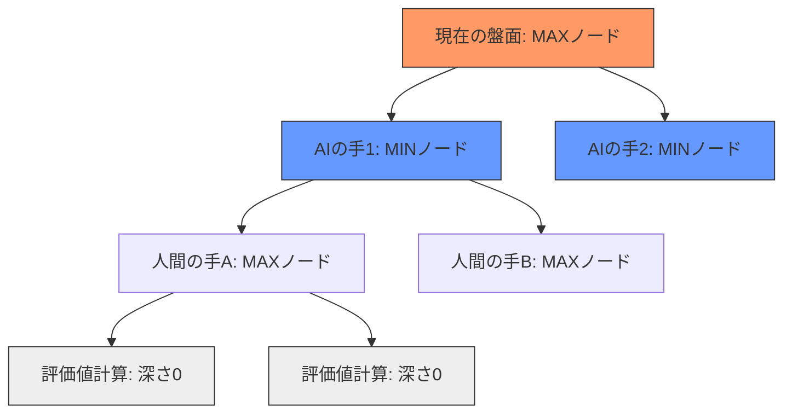

# 🎮 Reversi!! !!! 

ブラウザで遊べるリバーシ（オセロ）ゲームです！🖤⚪

## ✨ 特徴

- 🎯 **3つのAIモード** - ランダム、評価関数、ミニマックスから選択可能
- 🔄 **先手・後手選択** - 黒（先手）か白（後手）を自由に選択
- 💡 **合法手ハイライト** - 置ける場所が光って分かりやすい！
- 🎨 **見やすいUI** - グリーンの盤面とアニメーション効果
- 📱 **レスポンシブ** - ブラウザさえあれば遊べます

## 🚀 遊び方

1. **ブラウザで開く**  
   `index.html` をブラウザで開くだけ！

2. **設定を選ぶ**  
   - あなたの手番：先手（黒）か後手（白）を選択
   - COMの思考：AIの強さを選択
     - 🎲 **ランダム** - 適当に打つお気楽AI
     - 🧠 **評価関数** - 盤面の価値を考えるAI
     - 🤖 **ミニマックス** - 先読みする強力AI

3. **石を置く**  
   光っているマス（合法手）をクリックして石を置きます

4. **勝利を目指す**  
   最終的に自分の色の石が多い方が勝ち！🏆

## 📁 ファイル構成

```
game/reversi/
├── index.html          # メインHTMLファイル
├── style.css           # スタイルシート
├── src/
│   ├── reversi.ts      # TypeScriptソースコード
│   └── reversi.js      # コンパイル済みJavaScript
└── README.md           # このファイル
```

## 🎯 リバーシのルール

1. **初期配置**: 盤面中央に黒白が交互に2個ずつ配置
2. **石の配置**: 相手の石を挟めるマスにのみ置ける
3. **ひっくり返す**: 挟んだ石はすべて自分の色に変わる
4. **パス**: 置ける場所がない場合は自動的にパス
5. **勝敗**: 盤面が埋まったら石の数が多い方が勝ち

## 🧠 AIアルゴリズム

### 評価関数モード
盤面の各マスに重み付けをして評価します。

- 🏆 **角**:  最重要（取られない）
- ⚠️ **角の隣**: 避けたい（角を取られやすい）
- 📍 **その他**: 位置に応じた価値

### ミニマックスモード
ゲーム木を3手先まで探索し、最適な手を選択します。

- αβ枝刈りで効率的に探索
- 評価関数と組み合わせて盤面を評価
- より戦略的な打ち方が可能


## 🛠️ 開発情報

### 使用技術
- **HTML5** - 構造
- **CSS3** - スタイリング（アニメーション含む）
- **TypeScript/JavaScript** - ゲームロジック

### 主な機能実装
- ✅ リバーシのルール実装（合法手判定、石の反転）
- ✅ ミニマックスアルゴリズム（αβ枝刈り付き）
- ✅ 評価関数による盤面評価
- ✅ UIアニメーション（合法手のパルスエフェクト）
- ✅ ゲーム状態管理（パス、終了判定）

## 🎨 カスタマイズ

`style.css` のカラー変数を変更すれば、見た目をカスタマイズできます：

```css
:root {
    --bg-color: #2c3e50;      /* 背景色 */
    --board-color: #2e7d32;   /* 盤面の色 */
    --line-color: #1b5e20;    /* 線の色 */
}
```

## 📝 ライセンス

このプロジェクトは自由に使用・改変できます 🎉

---

**楽しくリバーシをプレイしてください！** 🎮✨
